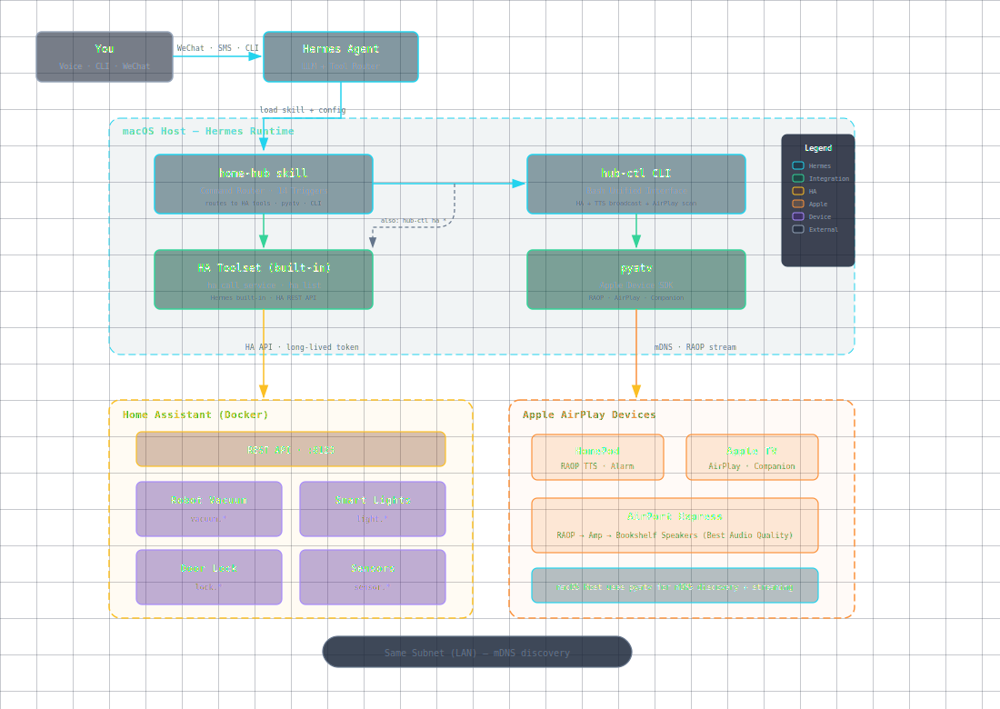

# Home Hub — Unified Smart Home Control

[中文](#chinese-section) | [English](#english-section)

---

## English Section

**Home Hub** is an open-source smart home control system for [Hermes Agent](https://hermes-agent.nousresearch.com). It unifies **Home Assistant**, **Apple AirPlay devices** (HomePod, Apple TV, AirPort Express), smart lights, robot vacuums, door locks, cameras, and sensors into a single voice-controlled interface.

> **Note:** This project is designed to work with Hermes Agent, but the core CLI (`scripts/hub-ctl`) can be used standalone on any macOS system with access to your smart home devices.

### Architecture



*[Open interactive diagram](docs/architecture.html)*

### Features

- **Home Assistant integration** — Control lights, vacuum, locks, sensors, and cameras via HA's built-in Hermes toolset or REST API
- **Voice broadcast** — TTS to HomePod, HomePod mini, and AirPort Express via pyatv RAOP
- **Robot vacuum control** — Start, stop, dock, locate, and adjust fan speed
- **Smart sensors** — Query temperature, humidity, door lock status, motion, and device states
- **Camera / surveillance** — Query camera states, motion events, snapshots from HA-integrated cameras
- **Unified CLI** — `hub-ctl` provides a single entry point for all operations
- **14 trigger scenarios** — Pre-configured natural language commands for common tasks (see SKILL.md)
- **CRON integration** — Schedule automated routines (weather reports, smart cleaning, security checks)

### Use Cases

#### 🌤 Morning Weather Report (CRON Scheduled)

Combine home-hub with Hermes CRON to wake up to a personalized weather briefing:

```bash
# Schedule a daily weather broadcast at 7:00 AM
hermes cron create \
  --name "morning-weather" \
  --schedule "0 7 * * *" \
  --prompt "Check today's weather, then broadcast a brief forecast
to the bedroom HomePod. Follow this format:
1. Get weather via web_search or a weather API
2. Compose a 1-2 sentence summary (temperature, conditions, high/low)
3. Say: hub-ctl airplay tts '<your message>' bedroom"
```

The agent reads the weather, composes a natural-language summary, and TTS-broadcasts it to your bedroom HomePod — no phone alarm needed.

You can also extend this pattern:
- **Traffic + weather**: Check commute conditions before work
- **Daily briefing**: Weather + calendar events + device health
- **Bedtime summary**: Tomorrow's forecast + door lock status + vacuum docked

#### 🧹 Sensor-Aware Robot Vacuum

Don't vacuum while you're home. Use HA occupancy sensors to clean intelligently:

```bash
# CRON: Check if anyone is home before starting vacuum
hermes cron create \
  --name "smart-vacuum" \
  --schedule "0 10 * * 1-5" \
  --prompt "Check occupancy sensors via ha_get_state. If no one
is home (all motion/binary sensors show 'off'), start the robot
vacuum. If someone is home, skip and report. Also check if vacuum
is already docked and charged >20% before starting."
```

Extended sensor logic:
- **Post-bedtime cleaning**: Check bedroom lights are off + no motion for 15 min → start living room vacuum
- **Presence-triggered**: When front door locks and no motion detected → auto-start entire house cleaning
- **Vacuum first, broadcast later**: Clean during empty hours, then TTS summary when you return
- **Error notification**: If vacuum gets stuck during cleaning → broadcast alert to HomePod

#### 📷 Camera & Surveillance

Integrate IP cameras and smart doorbells via Home Assistant:

```bash
# On-demand: check camera status
bash scripts/hub-ctl ha state camera.front_door

# CRON: monitor for package delivery
hermes cron create \
  --name "camera-watch" \
  --schedule "*/15 9-18 * * *" \
  --prompt "Check the front door camera's motion sensor state.
If motion detected in the last 15 minutes, check if a person is
still at the door. If so, ask me if I want to see the snapshot."
```

Camera use cases:
- **Doorbell press → notification**: When doorbell sensor triggers, broadcast "Someone at the door" to HomePod
- **Package alert**: Monitor front porch camera zone for package drop-off → TTS notification
- **Pet/Baby monitor**: Check nursery/living room camera on demand via voice command
- **Security recap**: Evening CRON that checks all camera motion events from today and reports
- **Snapshot on voice command**: "Show me the front door" → `ha_get_state(camera.front_door)` returns snapshot URL

#### 🧩 More Scenario Ideas

| Scenario | Trigger | Action |
|----------|---------|--------|
| Arrive home | Presence sensor → HA state change | TTS "Welcome home" + turn on living room lights |
| Leave home | All motion sensors off for 5 min | Vacuum starts + lights off + lock door |
| Bedtime | Voice: "good night" | Lock doors, turn off lights, set alarm, broadcast weather |
| Doorbell | Doorbell press sensor | Broadcast "Someone at the door" to living room HomePod |
| Rain alert | Weather API check | Broadcast "It's going to rain today" before you leave |
| Temperature extreme | HA sensor threshold | Broadcast "Bedroom temperature is 32°C" and turn on AC |
| Package delivered | Camera zone trigger | Broadcast "Package arrived at front door" + query snapshot |

> **Tip:** All CRON examples require the Hermes cron system. See [Hermes Docs → Cron](https://hermes-agent.nousresearch.com/docs/features/scheduled-tasks) for detailed configuration.

### Installation (from scratch)

A complete walkthrough for setting up Home Hub on a fresh macOS system.

#### 1. System Dependencies

```bash
# Install Homebrew (if not already installed)
/bin/bash -c "$(curl -fsSL https://raw.githubusercontent.com/Homebrew/install/HEAD/install.sh)"

# Install core dependencies
brew install ffmpeg python@3.12

# Install Python packages
pip3 install pyatv

# Verify
python3 -c "import pyatv; print(f'pyatv {pyatv.__version__}')"
```

#### 2. Install Docker

Download and install [Docker Desktop for Mac](https://www.docker.com/products/docker-desktop/), then verify:

```bash
docker --version
docker compose version
```

> **Note for Apple Silicon (M1/M2/M3):** Docker Desktop runs Intel images via Rosetta 2. Home Assistant publishes `arm64` images — use `homeassistant/home-assistant:stable` directly (no platform flag needed).

#### 3. Deploy Home Assistant

Create a directory structure and `docker-compose.yml`:

```bash
mkdir -p ~/homeassistant/config
cd ~/homeassistant
```

Create `docker-compose.yml`:

```yaml
version: '3.8'
services:
  homeassistant:
    image: homeassistant/home-assistant:stable
    container_name: homeassistant
    restart: unless-stopped
    network_mode: host
    volumes:
      - ./config:/config
      - /etc/localtime:/etc/localtime:ro
    environment:
      - TZ=Asia/Shanghai  # Change to your timezone
```

> **Why `network_mode: host`?** Home Assistant needs to discover devices on your LAN (Philips Hue, Bluetooth sensors, etc.). Bridge/NAT mode isolates the container and breaks discovery. Host mode shares the host network stack directly.

Start Home Assistant:

```bash
docker compose up -d
# Wait ~2 min for first boot, then visit http://localhost:8123
docker compose logs -f --tail=50  # Watch boot progress
```

#### 4. Initialize Home Assistant

1. Open **http://localhost:8123** in your browser
2. Create an admin account (name, username, password)
3. Set your home location on the map (for weather/automation)
4. Name your home (e.g. "Home")
5. Optional: Integrate devices — discover on LAN, or add integrations later

Generate a **Long-Lived Access Token** for hub-ctl:
- HA Web UI → bottom-left user menu → **Security**
- Scroll to **Long-Lived Access Tokens** → **Create Token**
- Name it (e.g. "home-hub") → Copy the token string immediately (it won't be shown again)

#### 5. Set Up Home Hub

```bash
# Clone the repo
git clone https://github.com/luxuguang-leo/hermes-smart-home-hub.git
cd hermes-smart-home-hub

# Configure environment
cp .env.example .env
# Edit .env:
#   HASS_URL=http://localhost:8123
#   HASS_TOKEN=<the-token-from-step-4>
```

Discover and map AirPlay devices:

```bash
bash scripts/hub-ctl airplay scan
# Output lists discovered HomePods, Apple TVs, and AirPort Express devices
# Edit the ROOMS array at the top of scripts/hub-ctl with your device IDs
```

Verify everything is connected:

```bash
bash scripts/hub-ctl status
# Should show: HA connected ✓, AirPlay devices found, room mapping OK
```

#### 6. (Optional) Enable Hermes Integration

If you use [Hermes Agent](https://hermes-agent.nousresearch.com):

```bash
# Mount the skill directory (two options):

# Option A — Symlink into ~/.hermes/skills/
ln -sf "$(pwd)/SKILL.md" ~/.hermes/skills/home-hub/SKILL.md

# Option B — Use external_dirs in ~/.hermes/config.yaml
# skills:
#   external_dirs:
#     - /path/to/hermes-smart-home-hub

# Enable the Home Assistant toolset
hermes tools enable homeassistant
```

Now Hermes can control your smart home using natural language. See **Quick Start** below for usage examples.

### Quick Start

After completing the [Installation](#installation-from-scratch) steps above:

```bash
# Check all device status
bash scripts/hub-ctl status

# TTS broadcast to all AirPlay devices
bash scripts/hub-ctl airplay tts "Good morning" all

# Start robot vacuum
bash scripts/hub-ctl ha vacuum start

# Query sensor state
bash scripts/hub-ctl ha state sensor.temperature_living
```

> **Prerequisites (quick reference):** macOS, Docker, Home Assistant instance, AirPlay 2 devices, pyatv (`pip install pyatv`), ffmpeg (`brew install ffmpeg`). Hermes Agent is optional — the CLI works standalone.

### Project Structure

```
home-hub/
├── README.md              # This file (bilingual)
├── SKILL.md               # Hermes Agent skill definition (English)
├── .env.example           # Environment variable template
├── docs/
│   └── architecture.html  # Dark-themed architecture diagram
├── scripts/
│   └── hub-ctl            # Unified CLI for all smart home operations
└── references/
    ├── device-map.md      # Room-to-device mapping conventions
    └── ha-integration.md  # HA REST API reference and usage
```

### Usage Examples

```bash
# Check all device status
bash scripts/hub-ctl status

# List HA entities (filter by domain)
bash scripts/hub-ctl ha list light
bash scripts/hub-ctl ha list vacuum
bash scripts/hub-ctl ha list camera

# Start robot vacuum
bash scripts/hub-ctl ha vacuum start

# TTS broadcast to all rooms
bash scripts/hub-ctl airplay tts "Good morning" all

# TTS to a specific room
bash scripts/hub-ctl airplay tts "Time for dinner" living

# Query sensor state
bash scripts/hub-ctl ha state sensor.temperature_living

# Query camera state
bash scripts/hub-ctl ha state camera.front_door

# Scan for AirPlay devices on network
bash scripts/hub-ctl airplay scan
```

### CRON Automation Examples

```bash
# Morning weather — daily at 7:00 AM
hermes cron create --name "morning-weather" --schedule "0 7 * * *" \
  --prompt "Get today's weather. Broadcast a brief forecast to bedroom HomePod."

# Smart vacuum — weekdays at 10:00 AM, only if nobody home
hermes cron create --name "smart-vacuum" --schedule "0 10 * * 1-5" \
  --prompt "Check occupancy sensors. If nobody home, start vacuum."

# Evening security check — daily at 10:00 PM
hermes cron create --name "evening-check" --schedule "0 22 * * *" \
  --prompt "Check front door lock is locked, all lights are off,
  and vacuum is docked. TTS summary to bedroom HomePod."
```

### Known Limitations

- **Docker cannot discover mDNS** — Apple device discovery must run on host macOS, not inside Docker
- **pyatv stream_file CLI has a bug** — Always use the Python API (`tts_to_homepod.py`) for RAOP streaming, not `atvremote`
- **HA tokens expire every 30 minutes** — Auto-refresh via `hass_auth_storage` mechanism in `hub-ctl`
- **RAOP volume needs 3x gain** — Default volume on HomePod is low; use `ffmpeg -af volume=3.0`
- **mDNS scan has ~50% failure rate** — Retry 3-5 times with 1s intervals
- **Apple TV (tvOS 18+) cannot be paired** — SRP M4 protocol incompatibility, awaiting pyatv update

### Roadmap / Future Work

Home Hub currently focuses on the **perception layer** (sensors, cameras, device states) and **basic control layer** (lights, vacuum, locks, TTS broadcast). These are the foundation for more intelligent automation. What comes next:

#### 🎯 Short-term

- **Weather-aware cleaning** — Skip vacuum if rain forecast (don't open windows + vacuum dust)
- **Multi-factor presence detection** — Combine motion sensors + WiFi presence + door lock state for accurate home/away detection
- **Camera snapshot delivery** — Send camera snapshots to WeChat/Telegram on motion trigger
- **Voice confirmation** — Before critical actions (e.g. unlocking door), ask for confirmation via HomePod TTS

#### 🚀 Medium-term

- **Scene mode** — Pre-defined scenes (Movie: dim lights, lock door; Guest: welcome lights, broadcast greeting)
- **Energy saving** — Auto-off lights in empty rooms after timeout, HVAC adjustment based on presence
- **Time-of-day rules** — Different vacuum behavior (morning: quiet mode; daytime: turbo)
- **Alert escalation** — Critical alerts broadcast to HomePod, less urgent ones sent to WeChat message only

#### 🤖 Long-term

- **ML-based anomaly detection** — Learn normal sensor patterns and alert on deviations (e.g. unusual temperature spike)
- **Multi-Hermes orchestration** — Coordinate across multiple Hermes instances (house + garage)
- **Voice control in Chinese** — Full Chinese natural language support for all operations
- **Guest mode** — Temporary access without permanent pairing, with activity log

> Have an idea? Open an issue or contribute! The architecture is designed to be extended via new HA sensors, CRON jobs, and additional Hermes skills.

### Related Projects

- [Hermes Agent](https://hermes-agent.nousresearch.com) — The agent framework this skill runs on
- [home-assistant](https://github.com/luxuguang-leo/hermes-skill-homelab/tree/main/skills/home-assistant) — HA integration skill for Hermes
- [apple-homepod-control](https://github.com/luxuguang-leo/hermes-skill-homelab/tree/main/skills/apple-homepod-control) — Apple device control skill for Hermes

### License

MIT

---

## 中文部分

**Home Hub** 是一个开源的智能家居统一控制系统，基于 [Hermes Agent](https://hermes-agent.nousresearch.com) 运行。它将 **Home Assistant**、**Apple AirPlay 设备**（HomePod、Apple TV、AirPort Express）、智能灯、扫地机器人、门锁、摄像头和传感器整合到统一的语音控制入口。

### 功能

- **Home Assistant 集成** — 通过 HA 内置工具集或 REST API 控制灯、扫地机、门锁、传感器、摄像头
- **语音广播** — 通过 pyatv RAOP 向 HomePod、HomePod mini、AirPort Express 广播 TTS
- **扫地机器人控制** — 开始清扫、停止、回充、定位、调吸力
- **智能传感器查询** — 温湿度、门锁状态、运动检测、设备状态
- **摄像头监控** — 查询摄像头状态、运动事件、快照
- **定时自动化** — 与 Hermes CRON 结合，设置天气播报、智能扫地、安防巡查
- **统一 CLI** — `hub-ctl` 一个命令管理所有设备
- **14 个触发场景** — 预置自然语言命令映射（见 SKILL.md）

### 应用场景

#### 🌤 早起天气播报（CRON 定时）

每天 7:00，Hermes 自动查天气 → TTS 广播到卧室 HomePod，替代闹钟：

```bash
hermes cron create --name "morning-weather" --schedule "0 7 * * *" \
  --prompt "查今天天气，简要播报到卧室 HomePod。格式如下：
  1. web_search 获取天气预报
  2. 编成 1-2 句话（温度、天气状况、最高/最低温）
  3. 说：hub-ctl airplay tts '<天气播报>' bedroom"
```

扩展玩法：
- **通勤助手**：天气 + 路况 + 限行信息
- **睡前简报**：明日天气 + 门锁状态 + 扫地机已归位
- **整点报时**：每小时播报时间 + 天气摘要

#### 🧹 智能扫地（传感器感知）

不在家时才扫，避免打扰：

```bash
# 工作日 10:00，先查有没有人
hermes cron create --name "smart-vacuum" --schedule "0 10 * * 1-5" \
  --prompt "查人体传感器。家里没人（所有 motion/binary sensor 为 off），
  才开始扫。有人就跳过。扫前确认电量 >20%。"
```

进阶逻辑：
- **睡前扫**：卧室灯关 + 15 分钟无运动 → 开始扫客厅
- **离家触发**：门锁上 + 无运动 → 全屋自动清扫
- **卡住警报**：扫地机被卡住 → 立刻广播到 HomePod 提醒

#### 📷 摄像头监控

通过 HA 集成 IP 摄像头和智能门铃：

```bash
# 随时查摄像头状态
bash scripts/hub-ctl ha state camera.front_door

# 每隔 15 分钟检查门口包裹
hermes cron create --name "camera-watch" --schedule "*/15 9-18 * * *" \
  --prompt "查门口摄像头运动检测状态。15 分钟内有人/物在门口，
  就问我要不要看截图。"
```

场景：
- **门铃触发**：门铃传感器激活 → HomePod 广播"有人按门铃"
- **快递通知**：门口摄像头检测到包裹放置 → 广播"快递到了" + 截图
- **宠物监控**：随时随地语音查客厅摄像头
- **夜间安防**：睡前 CRON 汇总当天所有摄像头动态

### 安装指南（从零开始）

在全新 macOS 系统上搭建 Home Hub 的完整流程。

#### 1. 系统依赖

```bash
# 安装 Homebrew（如果没有）
/bin/bash -c "$(curl -fsSL https://raw.githubusercontent.com/Homebrew/install/HEAD/install.sh)"

# 安装核心依赖
brew install ffmpeg python@3.12

# 安装 Python 包
pip3 install pyatv

# 验证
python3 -c "import pyatv; print(f'pyatv {pyatv.__version__}')"
```

#### 2. 安装 Docker

下载安装 [Docker Desktop for Mac](https://www.docker.com/products/docker-desktop/)，然后验证：

```bash
docker --version
docker compose version
```

> **Apple Silicon (M1/M2/M3) 注意：** Home Assistant 有原生 `arm64` 镜像，直接用 `homeassistant/home-assistant:stable` 即可，无需加 platform 参数。

#### 3. 部署 Home Assistant

创建目录和 `docker-compose.yml`：

```bash
mkdir -p ~/homeassistant/config
cd ~/homeassistant
```

创建 `docker-compose.yml`：

```yaml
version: '3.8'
services:
  homeassistant:
    image: homeassistant/home-assistant:stable
    container_name: homeassistant
    restart: unless-stopped
    network_mode: host
    volumes:
      - ./config:/config
      - /etc/localtime:/etc/localtime:ro
    environment:
      - TZ=Asia/Shanghai  # 改为你的时区
```

> **为什么用 `network_mode: host`？** HA 需要在局域网发现设备（Philips Hue、蓝牙传感器等），bridge 模式会隔离网络导致无法发现。host 模式让容器复用宿主机网络栈。

启动 Home Assistant：

```bash
docker compose up -d
# 等约 2 分钟启动，然后访问 http://localhost:8123
docker compose logs -f --tail=50  # 查看启动日志
```

#### 4. 初始化 Home Assistant

1. 浏览器打开 **http://localhost:8123**
2. 创建管理员账号（姓名、用户名、密码）
3. 在地图上设置家的位置（用于天气和自动化）
4. 给家取个名字（如"我的家"）
5. 可选：发现局域网设备或稍后添加集成

生成 **长期访问令牌** 给 hub-ctl：
- HA Web UI → 左下角用户菜单 → **安全**
- 滚动到 **长期访问令牌** → **创建令牌**
- 命名（如"home-hub"）→ **立即复制**令牌字符串（关闭后不再显示）

#### 5. 配置 Home Hub

```bash
# 克隆仓库
git clone https://github.com/luxuguang-leo/hermes-smart-home-hub.git
cd hermes-smart-home-hub

# 配置环境变量
cp .env.example .env
# 编辑 .env：
#   HASS_URL=http://localhost:8123
#   HASS_TOKEN=<上一步生成的令牌>
```

发现并映射 AirPlay 设备：

```bash
bash scripts/hub-ctl airplay scan
# 输出会列出家里的 HomePod、Apple TV、AirPort Express
# 然后编辑 scripts/hub-ctl 顶部的 ROOMS 数组，填入设备 ID
```

验证一切就绪：

```bash
bash scripts/hub-ctl status
# 应显示：HA 连接 ✓、AirPlay 设备已发现、房间映射正常
```

#### 6. （可选）集成 Hermes Agent

如果使用 [Hermes Agent](https://hermes-agent.nousresearch.com)：

```bash
# 挂载 skill 目录（二选一）：

# 方案 A — 软链到 ~/.hermes/skills/
ln -sf "$(pwd)/SKILL.md" ~/.hermes/skills/home-hub/SKILL.md

# 方案 B — 在 ~/.hermes/config.yaml 中使用 external_dirs
# skills:
#   external_dirs:
#     - /path/to/hermes-smart-home-hub

# 启用 Home Assistant 工具集
hermes tools enable homeassistant
```

配置完成后，Hermes 即可用自然语言控制你的智能家居。下面是一些快速上手的命令示例。

### 快速开始

安装完成后，常用命令：

```bash
# 查看所有设备状态
bash scripts/hub-ctl status

# 语音广播到所有 AirPlay 设备
bash scripts/hub-ctl airplay tts "早上好" all

# 启动扫地机器人
bash scripts/hub-ctl ha vacuum start

# 查询传感器状态
bash scripts/hub-ctl ha state sensor.temperature_living
```

### 目录结构

```
home-hub/
├── README.md              # 本文件（双语）
├── SKILL.md               # Hermes Agent 技能描述
├── .env.example           # 环境变量模板
├── docs/
│   └── architecture.html  # 暗色架构图
├── scripts/
│   └── hub-ctl            # 统一管理 CLI
└── references/
    ├── device-map.md      # 房间设备映射参考
    └── ha-integration.md  # HA API 参考
```

### CRON 自动化示例

```bash
# 早上天气播报 — 每天 7:00
hermes cron create --name "morning-weather" --schedule "0 7 * * *" \
  --prompt "查今天天气，简要播报到卧室 HomePod。"

# 智能扫地 — 工作日 10:00，家里没人时
hermes cron create --name "smart-vacuum" --schedule "0 10 * * 1-5" \
  --prompt "查人体传感器。家里没人就开始扫地。"

# 晚间安防 — 每天 22:00
hermes cron create --name "evening-check" --schedule "0 22 * * *" \
  --prompt "查门锁已锁、所有灯已关、扫地机已归位。汇总播报到卧室 HomePod。"
```

### 未来规划

Home Hub 目前主要集中在**感知层**（传感器、摄像头、设备状态）和**基础控制层**（灯、扫地机、门锁、语音广播），为更智能的自动化打下基础。后续规划：

#### 🎯 近期

- **天气感知清扫** — 下雨天不开窗吸尘，跳过清扫
- **多因素人体检测** — 运动传感器 + WiFi 存在 + 门锁状态综合判断是否有人在家
- **摄像头截图推送** — 检测到运动时把截图推送到微信/Telegram
- **语音确认** — 关键操作（如开锁）前通过 HomePod 语音确认

#### 🚀 中期

- **场景模式** — 预设场景（影院：关灯、锁门；迎客：开灯、语音问候）
- **节能策略** — 无人房间定时关灯，根据人员在位调整空调
- **时段规则** — 不同时段不同行为（早上安静模式扫地，白天强吸力）
- **告警分级** — 紧急告警 HomePod 广播，普通告警微信消息

#### 🤖 长期

- **ML 异常检测** — 学习正常传感器模式，偏离时告警（如异常温度急升）
- **多 Hermes 编排** — 跨多个实例协同（屋内 + 车库）
- **全中文语音控制** — 所有操作支持中文自然语言
- **访客模式** — 临时授权访问，操作日志可追溯

> 有想法？欢迎提 issue 或贡献代码。架构设计为可扩展，通过新增 HA 传感器、CRON 任务和 Hermes skill 实现。

### 已知限制

- Docker 无法发现 mDNS 设备，Apple 设备控制须在 Mac 宿主机上运行
- pyatv stream_file CLI 有 bug，RAOP 广播须用 Python API
- HA token 每 30 分钟过期，hub-ctl 内置自动刷新
- mDNS 扫描约 50% 失败率，需重试 3-5 次
- Apple TV (tvOS 18+) 目前无法配对

---

### 许可证

MIT
